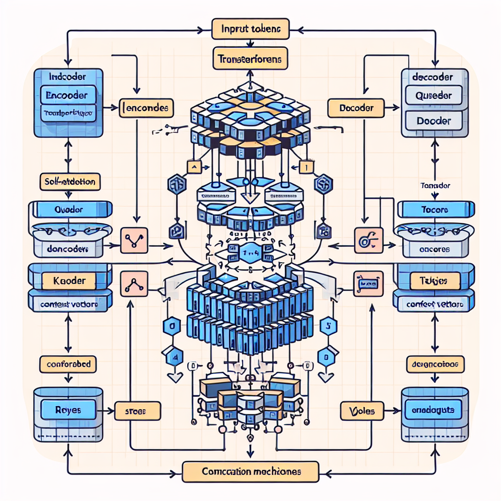
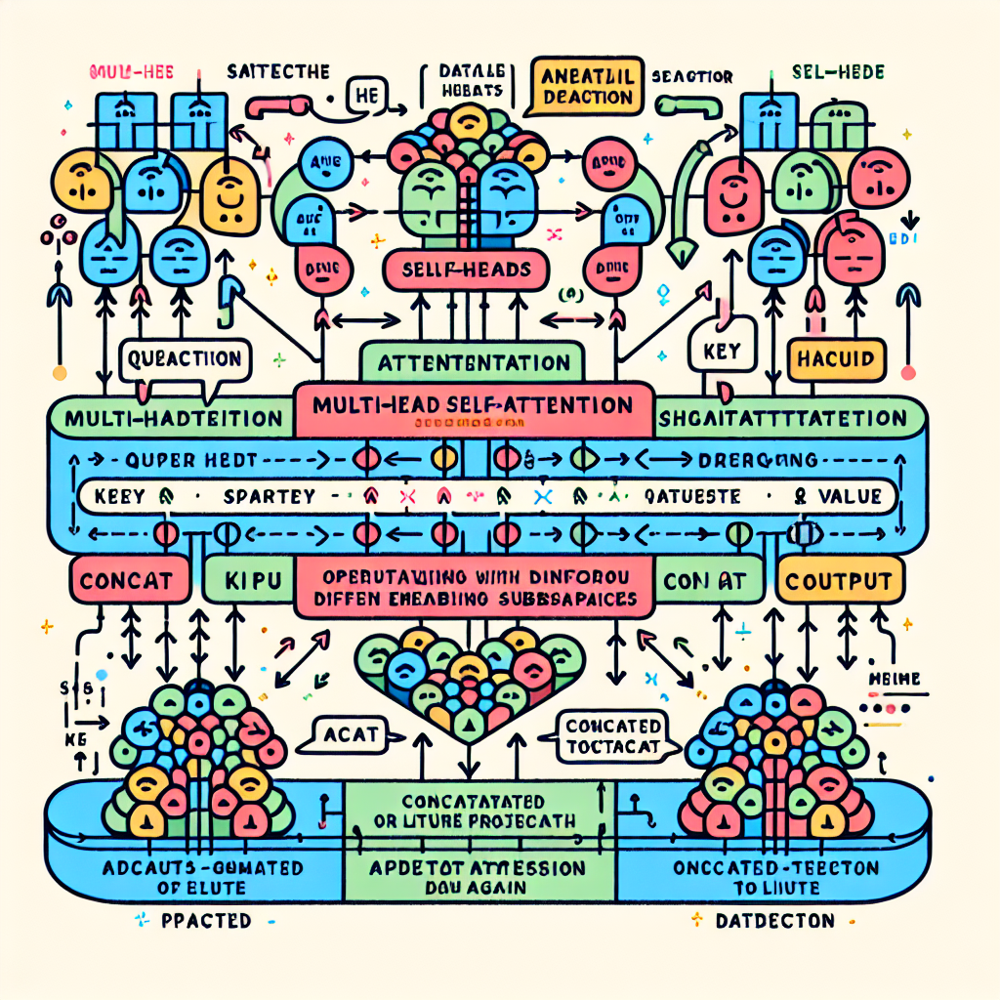
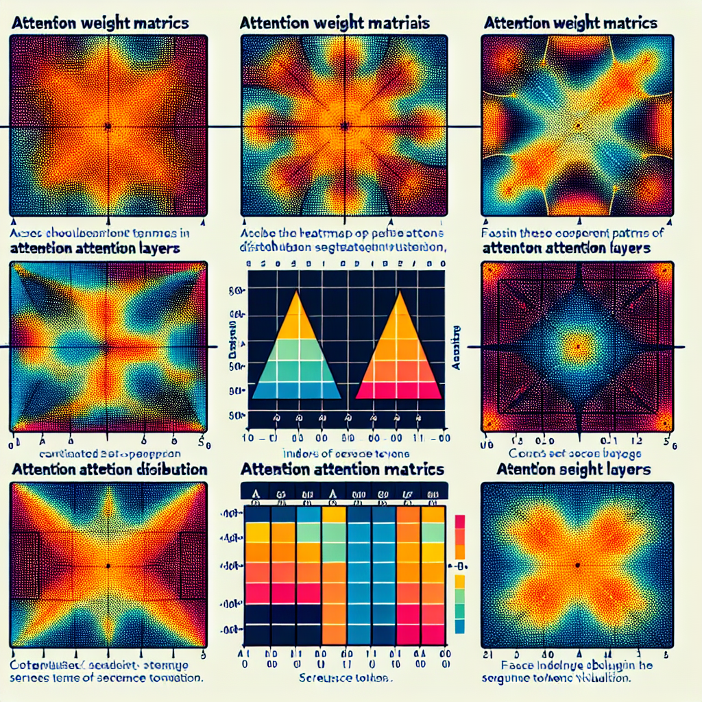

# Understanding Self-Attention in Transformer Architecture

## Introduction to Transformer Architecture and the Role of Self-Attention

The Transformer architecture revolutionized sequence modeling by departing from traditional recurrent and convolutional approaches. It comprises two main components: the encoder and the decoder, each stacked with multiple identical layers. The encoder layers process the input sequence, creating rich contextual representations, while the decoder layers generate the output sequence, attending both to the previously generated outputs and the encoder’s representations.

Historically, sequence models relied heavily on Recurrent Neural Networks (RNNs) and Convolutional Neural Networks (CNNs). However, these architectures have limitations: RNNs process sequences sequentially, which limits parallelism and slows training, and they struggle to capture long-range dependencies effectively. CNNs allow more parallelization but require deep stacks or carefully designed kernels to manage context over long distances.

Attention mechanisms, particularly self-attention, addressed these challenges by letting each token in a sequence directly interact with every other token. In the context of Transformers, self-attention computes contextual relationships within the same sequence, enabling the model to weigh the relevance of each token relative to others when forming its representation. This approach is highly parallelizable because it treats all tokens simultaneously rather than sequentially, which significantly speeds up training and inference.

Self-attention’s advantages are twofold: first, it allows the model to capture long-range dependencies efficiently without the bottleneck of sequential processing; second, it facilitates parallel computation across tokens, maximizing hardware utilization and training speed. This fundamental shift enhances both the quality of learned representations and the scalability of sequence models.

Key to understanding self-attention are the concepts of queries, keys, and values. Each token in the input sequence is transformed into these three vectors. The query vector represents the token we want to find relevant information for, keys represent tokens that can provide that information, and values are the actual information carried by those tokens. The self-attention mechanism computes scores by comparing queries against all keys, determining how much focus each token should have on others. These scores weight the corresponding values, resulting in a new, context-aware representation for each token.

This conceptual framework allows Transformers to replace RNNs and CNNs effectively, making self-attention a cornerstone of modern natural language processing and other sequence-related tasks.


*Overview diagram of the Transformer architecture showing encoder and decoder stacks and illustrating the self-attention mechanism.*

## Mechanics of Scaled Dot-Product Self-Attention

In a Transformer layer, self-attention enables the model to weigh the importance of each token in the input sequence relative to others. This mechanism relies on transforming input embeddings into three distinct representations known as queries, keys, and values. These are obtained by applying learned linear projection matrices to the input embeddings. Formally, if the input embedding for a token is \( x \), the model computes:

- Query \( q = W_Q x \)
- Key \( k = W_K x \)
- Value \( v = W_V x \)

where \( W_Q, W_K, \) and \( W_V \) are the learned weight matrices for queries, keys, and values respectively. These projections allow the model to map the same input into spaces specialized for matching (queries and keys) and aggregation (values).

Next, the core of self-attention is the calculation of raw attention scores by taking the dot product between each query vector and all key vectors in the sequence. This raw score indicates how well each token attends to every other token. Because the dot product grows with the dimensionality \( d_k \) of the key vectors, the scores are scaled by dividing by \( \sqrt{d_k} \). This scaling prevents the scores from becoming too large, which would cause the softmax function to saturate and gradients to vanish during training.

The method applies softmax over these scaled attention scores to convert them into normalized attention weights that sum to 1. Softmax highlights the most relevant tokens by assigning them higher weights while suppressing less important ones, providing a smooth probability distribution.

Finally, the output for each token is computed as a weighted sum of the value vectors, using the attention weights as coefficients. This weighted sum effectively aggregates information from the entire sequence, weighted by relevance determined by the self-attention mechanism.

Here is a minimal PyTorch-style code snippet illustrating this flow for one self-attention head:

```python
import torch
import torch.nn.functional as F

def scaled_dot_product_attention(Q, K, V):
    d_k = Q.size(-1)
    # Compute raw attention scores (batch_size, seq_len, seq_len)
    scores = torch.matmul(Q, K.transpose(-2, -1)) / torch.sqrt(torch.tensor(d_k, dtype=torch.float32))
    # Apply softmax to get attention weights
    attn_weights = F.softmax(scores, dim=-1)
    # Weighted sum of values based on attention weights
    output = torch.matmul(attn_weights, V)
    return output, attn_weights

# Example input embeddings: batch_size x seq_len x embedding_dim
input_emb = torch.rand(1, 5, 64)  
W_Q = torch.rand(64, 64)
W_K = torch.rand(64, 64)
W_V = torch.rand(64, 64)

Q = torch.matmul(input_emb, W_Q)  # Queries
K = torch.matmul(input_emb, W_K)  # Keys
V = torch.matmul(input_emb, W_V)  # Values

output, attn = scaled_dot_product_attention(Q, K, V)
print("Output shape:", output.shape)
print("Attention weights shape:", attn.shape)
```

This snippet highlights the core steps: projection, scaling, softmax normalization, and aggregation. When developing or debugging Transformer models, monitoring attention weights and verifying stable scaling is crucial for diagnosing performance bottlenecks or training instabilities. Proper scaling and softmax usage help maintain effective gradient flow, ensuring the model learns meaningful relationships across sequence tokens.

## Multi-Head Self-Attention and Its Benefits

Multi-head attention is a core enhancement in the transformer architecture that consists of running several self-attention mechanisms in parallel, each with its own set of learnable parameters. Instead of relying on a single attention function, the model splits the input embeddings into multiple "heads," allowing each to attend to different parts of the sequence or learn varied features independently.

Each attention head operates on a distinct subspace of the embedding dimensions. This means individual heads can specialize in capturing different types of relationships, such as syntax, semantics, or positional nuances. By focusing on separate representation subspaces, multi-head attention enables the model to aggregate diverse and complementary information across tokens.

The outputs from all these heads are then concatenated and passed through a final linear layer, which blends their distinct insights into a unified representation. This recombination allows the model to jointly reason about multiple features simultaneously and synthesize richer contextual embeddings than a single-head approach could produce alone.

One of the main advantages of multi-head attention is its ability to learn more robust and diverse contextual relationships within the input data. This often leads to improved generalization and reduced overfitting because the model does not overly rely on a single attention pattern or feature. Instead, it balances multiple perspectives, which enhances interpretability and expressiveness.

However, these benefits come with performance trade-offs. Running multiple parallel attention heads significantly increases computational requirements, memory usage, and latency. Each additional head adds parameters and matrix operations, which can impact training and inference speed or require more hardware resources. Therefore, choosing the number of heads involves balancing modeling capacity against computational cost, informed by the specific application constraints.

In summary, multi-head self-attention boosts a transformer's capacity to model complex dependencies by decomposing the attention mechanism into several parallel processes, each learning distinct aspects of the input. Despite its higher computational demands, this design fosters richer representations and stronger generalization, making it a pivotal technique in modern deep learning architectures.


*Diagram depicting multi-head self-attention with multiple attention heads processing different subspaces in parallel, followed by concatenation and a final linear layer.*

## Edge Cases and Failure Modes in Self-Attention Mechanisms

When implementing or tuning self-attention in transformer models, developers often encounter several key issues that can hinder performance and model stability. Understanding these failure modes is essential for effective debugging and optimization.

### Softmax Saturation and Attention Collapse

A common problem arises when the softmax function produces overly sharp attention distributions, collapsing focus onto a single position or a few tokens. This saturation can limit the model’s ability to leverage broader contextual information, effectively reducing self-attention’s capacity. It often occurs when input logits have large magnitude differences, causing numerical instability. To mitigate this, techniques like temperature scaling of logits before softmax or careful normalization of input features can help maintain a more balanced attention distribution.

### Fixed Sequence Length and Quadratic Complexity

Self-attention mechanism’s computational cost scales quadratically with input sequence length, making it expensive and memory-intensive for long sequences. Moreover, many implementations assume a fixed maximum sequence length, leading to inefficiencies or errors when input sizes vary. This limitation affects scalability and requires careful design decisions, such as segmenting long inputs or adopting sparse or approximated attention variants. Ignoring these constraints may cause the system to exceed memory budget or experience significant slowdowns during training or inference.

### Improper Initialization of Projection Matrices

Projection matrices used to compute query, key, and value vectors are critical components of the attention mechanism. Poor initialization can lead to unstable training dynamics, including exploding or vanishing gradients. For example, initializing weights with overly large values may cause activations to saturate nonlinearities prematurely, destabilizing the learning process. Consistent use of initialization schemes like Xavier or Kaiming initialization tailored to the activation functions in use is vital to ensure smooth convergence.

### Challenges in Low-Resource or Noisy Data Settings

In scenarios with limited or noisy data, self-attention distributions may become diffuse or uninformative. The model struggles to establish meaningful relationships between tokens, leading to attention weights that fail to highlight salient features. This results in degraded representational power and poorer generalization on downstream tasks. Techniques such as attention dropout, data augmentation, or pretraining on larger datasets can alleviate some of these effects.

### Evaluation and Debugging Strategies

Detecting these failure modes involves both quantitative and qualitative evaluation:

- **Visualization:** Plot attention maps to inspect whether distributions are overly peaked, uniform, or focused on irrelevant tokens.
- **Monitoring statistics:** Track metrics like attention entropy and gradient norms to identify saturation or instability.
- **Ablation studies:** Evaluate model behavior by varying sequence lengths, initialization methods, and data quality.
- **Performance profiling:** Measure memory use and computational time to expose scalability bottlenecks.

Addressing these failure cases early in development improves model robustness and leads to more reliable transformer applications.

## Performance and Memory Considerations in Self-Attention

Self-attention in transformer models inherently involves computational and memory costs that scale quadratically with the input sequence length \( n \). Specifically, both time complexity and space complexity are \( O(n^2) \) because the attention mechanism calculates pairwise interactions between all tokens in the sequence. This quadratic scaling limits the practical input size and increases resource demands, posing challenges for deploying transformers on long sequences or in resource-constrained environments.

To mitigate these issues, several optimization techniques have emerged:

- **Sparse Attention:** Instead of computing attention scores for every token pair, sparse attention restricts computations to a subset of relevant tokens, reducing complexity to near-linear in some implementations.
- **Pruning Attention Heads:** Eliminating less important attention heads dynamically or statically can cut down unnecessary computations without drastically affecting model performance.
- **Approximate Nearest Neighbors (ANN):** Utilizing ANN algorithms to identify the most relevant tokens for each query token allows the model to approximate full attention with fewer computations.

Balancing hardware efficiency and model accuracy also requires thoughtful choices around batch size and numerical precision:

- **Batch Size:** Larger batches improve GPU utilization and throughput but demand more memory, which may limit sequence length or model size. Tuning batch size can help maximize hardware efficiency while avoiding out-of-memory errors.
- **Precision:** Running models in mixed precision (FP16) reduces memory footprint and accelerates computations compared to FP32. However, this can introduce numerical instability or slight accuracy drops if not carefully managed through loss scaling and hardware support.

Profiling and monitoring tools are essential for diagnosing performance bottlenecks in self-attention layers. Frameworks like PyTorch and TensorFlow provide built-in profilers to measure execution time and memory usage per operation. Additionally, third-party tools such as NVIDIA Nsight Systems or TensorBoard can offer deeper insights into GPU utilization and resource allocation during attention computation stages.

In production environments, there is a balancing act between computational cost and model accuracy. Aggressive optimizations might degrade model quality, while minimal optimization can lead to expensive or infeasible deployment. It is crucial to evaluate these trade-offs in the context of application requirements, hardware capabilities, and latency constraints to find an optimal operational point. Iterative profiling and performance tuning, combined with careful model architecture decisions, enable scalable and efficient transformer deployment that meets both accuracy and efficiency goals.

## Debugging and Observability Tips for Self-Attention Layers

Effective debugging and observability are crucial when developing and refining self-attention layers in transformer architectures. Here are practical strategies to make self-attention mechanisms more transparent and diagnose potential issues efficiently.

- **Extract and Visualize Attention Weights:**  
  One of the most direct ways to understand what the model focuses on is to extract the attention weight matrices during forward passes. Visualizing these weights as heatmaps can reveal which tokens attend to which others, highlighting patterns like key token dependencies or unexpected attention distributions. Tools such as Matplotlib or seaborn can aid in rendering these heatmaps dynamically or post-experimentation.
- **Monitor Gradients and Parameter Updates:**  
  Keep a close eye on the gradients flowing through the projection matrices (queries, keys, values) by logging gradient norms and parameter updates per training step. Rapid decay towards zero (vanishing gradients) or excessively large values (exploding gradients) can disrupt learning. Layer-wise gradient clipping and adaptive learning rate scheduling can mitigate these issues once identified.
- **Unit Testing with Known Input Patterns:**  
  Design unit tests for your attention modules using synthetic inputs with predictable attention outputs. For instance, feeding inputs where each token should only attend to itself or a fixed set of tokens allows you to verify that the attention scores and outputs behave as theoretically expected. These checks ensure the implementations adhere to design and catch bugs early.
- **Validate Attention Masking and Handling of Padding Tokens:**  
  Masking mechanisms prevent attention to irrelevant tokens such as paddings. Confirming the correct application of these masks is essential. Test cases can involve sequences with varying lengths and padded tokens, checking that attention weights on padding positions are near zero, and that the masks propagate correctly through the attention computations without modifying unmasked positions.
- **Integrate Real-Time Visualization Tools:**  
  Leveraging TensorBoard or analogous visualization platforms enables live monitoring of self-attention during training and inference. Integrate hooks that log attention maps, parameter histograms, and gradient metrics. Real-time dashboards facilitate iterative debugging and performance tuning by correlating model behavior with changes in attention dynamics.

By applying these techniques, developers can gain actionable insights into self-attention mechanisms, enabling quicker diagnosis of issues and more informed optimization of transformer models.


*Example visualizations of attention weight matrices as heatmaps for debugging self-attention layers, demonstrating varied attention patterns over input tokens.*