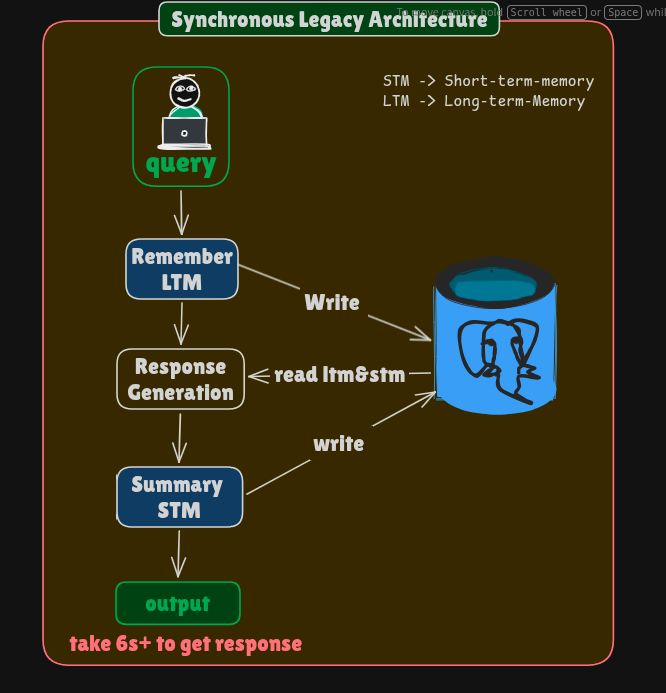
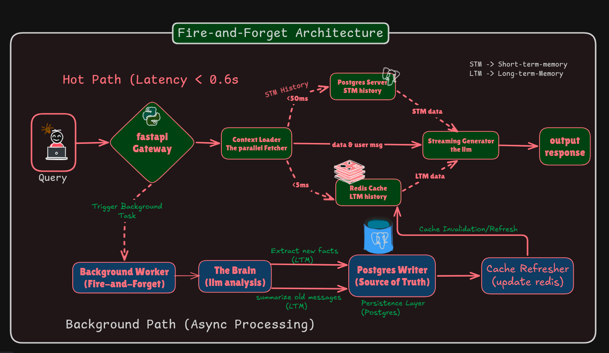

# 🧠 SynapseAI: High-Performance Memory Agent


**SynapseAI** is an asynchronous, memory-augmented chatbot designed for production environments. It features persistent **Long-Term Memory (LTM)** and **Short-Term Context (STM)** while maintaining sub-second latency.

By moving from a sequential architecture to a **"Fire-and-Forget"** asynchronous architecture, this project reduced API latency from **6.0s to 0.6s (a 10x performance boost)**.

---

## 🚀 The Architecture Evolution

The core engineering challenge was handling expensive LLM operations (Memory Extraction & Summarization) without making the user wait.

### ❌ Before: Synchronous Legacy Architecture (6s Latency)
In the prototype phase, the system ran sequentially. The user had to wait for the database to update before receiving a reply.
*(Place your first image here)*


### ✅ After: SynapseAI Fire-and-Forget Architecture (0.6s Latency)
We decoupled the **Read Path** (Hot) from the **Write Path** (Cold). The user receives a streamed response immediately via Redis/Postgres read-replicas, while the heavy logic runs in background tasks.
*(Place your second image here)*


---

## ⚡ Key Features

*   **🧠 Hybrid Memory System:**
    *   **LTM (Long-Term Memory):** Stores user facts (Name, Location, Profession) in Postgres + Redis.
    *   **STM (Short-Term Memory):** Tracks active conversation context with auto-summarization.
*   **🏎️ Sub-Second Latency:** Uses **Redis** for optimistic caching and `asyncio.gather` for parallel fetching.
*   **🌊 Real-Time Streaming:** Server-Sent Events (SSE) provide instant feedback to the user.
*   **⚙️ Background Intelligence:** Heavy tasks (Fact Extraction, History Pruning) run in `FastAPI BackgroundTasks` to ensure non-blocking UI.
*   **🐳 Dockerized:** Fully containerized with `docker-compose` for easy deployment.

---

## 🛠️ Tech Stack

*   **Language:** Python 3.12+
*   **API Framework:** FastAPI (Async/Await)
*   **Orchestration:** LangGraph (State Management)
*   **Database:** PostgreSQL (with `pgvector` support if needed)
*   **Caching:** Redis (Async)
*   **LLM:** OpenAI GPT-4o / GPT-4o-mini

---

## 📂 Project Structure

The project follows **Domain-Driven Design (DDD)** principles for scalability.

```text
chatbot_backend/
├── app/
│   ├── api/                # API Route Handlers (Traffic Controller)
│   ├── core/               # Database & Config (Postgres/Redis pools)
│   ├── models/             # Pydantic Schemas & State Definitions
│   ├── services/           # Business Logic
│   │   ├── background.py   # The "Cold Path" (Writes)
│   │   ├── chat_generator.py # The "Hot Path" (Reads/Stream)
│   │   └── memory_service.py # Hybrid Cache Logic
│   └── utils/              # Prompts & Helpers
├── tests/                  # Integration Tests
├── main.py                 # Application Entrypoint
├── Dockerfile              # Container Definition
└── docker-compose.yml      # Orchestration
```

---

## 🏃‍♂️ Getting Started

### Prerequisites
*   Docker & Docker Compose
*   OpenAI API Key

### 1. Clone the Repository
```bash
git clone https://github.com/yourusername/synapse-ai.git
cd synapse-ai
```

### 2. Configure Environment
Create a `.env` file in the root directory:
```env
OPENAI_API_KEY=sk-proj-your-key-here
DATABASE_URL=postgresql://postgres:postgres@db:5432/postgres?sslmode=disable
REDIS_URL=redis://cache:6379/0
LOG_LEVEL=INFO
```

### 3. Run with Docker
```bash
docker-compose up --build
```
The API will be available at `http://localhost:8000`.

---

## 🔌 API Usage

### Chat Endpoint (Streaming)
**POST** `/api/v1/chat`

```bash
curl -N -X POST http://localhost:8000/api/v1/chat \
  -H "Content-Type: application/json" \
  -d '{
    "user_id": "user_123",
    "thread_id": "thread_abc",
    "message": "Hi, I am Al Amin. I live in Dhaka."
  }'
```

**Response:**
The response is a **Stream** of text chunks.
*(Check the server logs to see the background tasks updating memory after the response completes!)*

---

## 🧪 Engineering Deep Dive

### 1. Parallel Context Loading
Instead of querying the DB sequentially, we use `asyncio.gather` to fetch the **User Profile (from Redis)** and **Chat History (from Postgres)** simultaneously. This reduces the "Time to First Token" (TTFT) significantly.

### 2. The "Speculative" Prompt
Since the background task updates the DB *after* the reply, there is a theoretical 3-second consistency gap. We solved this via Prompt Engineering:
> *"Trust the User's current message over the User Profile if they contradict each other."*
This ensures the bot feels "smart" even if the DB is milliseconds behind.

### 3. Redis "Write-Through" Cache
*   **Read:** Try Redis -> Miss? -> Postgres -> Populate Redis.
*   **Write:** Background Task -> Update Postgres -> Update Redis.
This ensures 99% of chat requests hit the cache, bypassing the database entirely.

---

## 🤝 Contributing

Contributions are welcome! Please open an issue or submit a PR for improvements.

## 📄 License

MIT License. See `LICENSE` for details.

---

**Built with ❤️ by Md Al Amin**